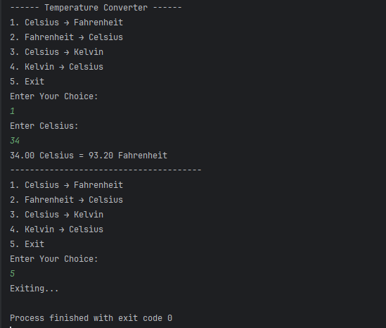

# Temperature Converter - Java

## Internship Track
SkillCraft Technology - Software Engineering (Task 1)

## Description
A menu-driven Java console application that converts temperatures between Celsius, Fahrenheit, and Kelvin scales.

## Features
- User-driven menu interface
- Multiple temperature conversion options
- Input validation
- Loop-based execution until exit
- Clean formatted output

## Technologies Used
- Java
- OOP Concepts
- Scanner Class
- Conditional Statements

## How to Run
1. Compile the file:
   javac TemperatureConverter.java
2. Run the program:
   java TemperatureConverter

## Learning Outcome
- Modular program design
- User interaction handling
- Clean console application structure

## Screenshot

